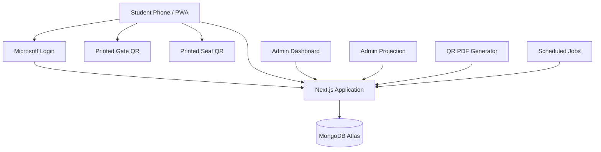
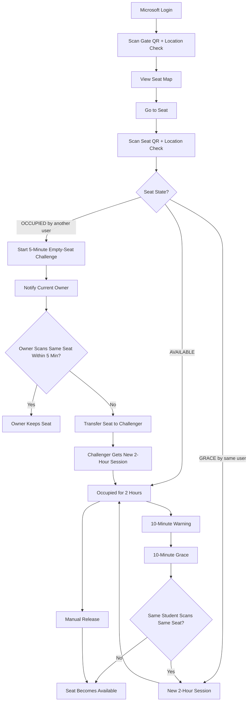
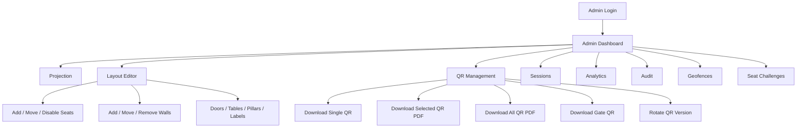

# Kameng Library Seat Management System
## Complete 0-to-100 Simplified Real-World Project Blueprint

> A low-cost library seat management system using **Next.js + TypeScript + MongoDB + Microsoft institute login + one Gate QR + one Seat QR + coordinate/geofence verification + 2-hour seat sessions + 10-minute re-occupy grace + 5-minute empty-seat challenge + live occupancy + admin-only projection + editable seat layout + QR PDF export**.

---

# 1. Final Project Idea

The student flow should stay extremely simple:

```text
Login with IITG Microsoft account
        ↓
Scan the Gate QR once
+ pass coordinate/geofence check
        ↓
See live seat availability
        ↓
Go to a FREE seat
        ↓
Scan that seat's QR
+ pass coordinate/geofence check
        ↓
Seat becomes OCCUPIED for 2 hours
```

After 2 hours:

```text
2-hour session ends
        ↓
Seat enters 10-minute GRACE
        ↓
Only the same student can re-occupy it
        ↓
Student scans the same seat QR
        ↓
Another 2-hour session starts
```

If the student does not re-occupy it during the 10-minute grace period:

```text
Seat becomes AVAILABLE
```

If a different student finds an `OCCUPIED` seat physically empty:

```text
Scan that empty seat's QR
        ↓
Coordinate/geofence check
        ↓
Current owner gets a 5-minute warning
        ↓
Owner must return and scan the same seat QR
        ↓
If owner does not verify in 5 minutes
        ↓
Seat transfers to the waiting challenger
```

There are:

```text
NO random checkpoint QRs
NO rotating screen QR
NO random walking/checkpoint requirement
NO dedicated hardware
NO RFID
NO face recognition
NO seat sensors
```

---

# 2. Main Goal

The application must answer this question accurately:

> **How many library seats are free right now, and which seats are free?**

It should also stop a seat from remaining occupied forever when a student leaves without updating the system.

---

# 3. Student Features

Students can:

- sign in using an allowed Microsoft institute account,
- scan the main library Gate QR,
- allow location permission while scanning,
- pass an admin-configured library coordinate/geofence check,
- see total, free, occupied, grace, maintenance, and disabled seats,
- view the current library seat layout,
- see seat numbers,
- scan a seat QR to occupy that seat,
- keep the seat for 2 hours,
- receive expiry notifications,
- get a 10-minute re-occupy grace period,
- scan the same seat QR during grace to continue using it,
- release the seat manually before 2 hours,
- see their current seat and remaining time,
- scan an `OCCUPIED` seat that is physically empty to raise an **Empty Seat Challenge**,
- wait up to 5 minutes while the current seat owner is notified,
- receive that seat automatically if the current owner does not return and scan the same seat QR within 5 minutes.

The empty-seat challenge does **not** require the challenger to walk to any other seat. The challenger is already standing at the apparently empty seat they want to use.

---

# 4. Admin Features

Admin can:

- access an admin-only dashboard,
- access an admin-only fullscreen projection page,
- see live occupancy,
- see occupancy percentage,
- see occupancy over time,
- see today's peak occupancy,
- see active, grace, and pending empty-seat challenge sessions,
- force-release a seat,
- mark a seat as maintenance,
- disable/enable a seat,
- add new seats,
- remove/disable seats,
- edit seat numbers and labels,
- move seats on the visual layout,
- add/remove/move walls,
- add doors,
- add tables,
- add pillars,
- add labels,
- change the size and position of layout elements,
- manage allowed library coordinates/geofences,
- add a geofence using latitude, longitude, and allowed radius,
- edit a geofence,
- enable/disable a geofence,
- remove a geofence,
- decide whether location checking is required for Gate scans and Seat scans,
- view pending and historical empty-seat challenges,
- generate QR codes,
- download **one seat QR**,
- download **multiple selected seat QRs**,
- download **all seat QRs in one PDF**,
- download/print the Gate QR,
- rotate QR versions,
- view audit logs.

---

# 5. Why the Flow Is Simple

Do not make a student walk around the library just to verify presence.

That can disturb people who are already studying.

The normal student flow uses only:

```text
1. Gate QR
2. Student's own chosen Seat QR
```

If a student sees a seat that the system says is `OCCUPIED` but the physical seat is empty, they may scan **that same empty seat's QR** to raise a 5-minute verification challenge.

They never need to scan:

```text
another occupied student's physical seat
a random checkpoint
a wall QR
a rotating display QR
```

The coordinate/geofence check runs silently during Gate and Seat scans after the student grants browser location permission.

---

# 6. Basic Physical Setup

The physical setup requires only printed QR labels.

## Gate

Place one QR near the library entrance:

```text
KAMENG LIBRARY

SCAN TO ENTER

[ GATE QR ]
```

## Seats

Each seat gets one QR:

```text
SEAT 023

[ SEAT QR ]

A-023
```

No screen is necessary.

---

# 7. Security Model and Honest Limitations

The project uses two low-cost physical signals:

```text
printed Gate QR
printed Seat QR
```

and one software/device signal:

```text
browser geolocation checked against admin-configured library coordinates
```

Every Gate QR and Seat QR scan should include:

```text
latitude
longitude
reported accuracy
```

The server checks whether the scan is inside an enabled library geofence.

This makes a saved QR photo less useful when a student tries to scan it from a hostel or another distant location.

However, geolocation is **not perfect seat-level proof**:

- indoor GPS can be inaccurate,
- some devices report coarse location,
- nearby campus buildings may fall inside a large radius,
- advanced users may spoof browser/device location.

Therefore treat geolocation as a strong additional check for the MVP, not as infallible proof of a specific chair.

Use these protections together:

```text
Microsoft institute identity
one active seat per student
one student per seat
Gate visit/session
admin-managed geofence validation
signed QR payloads
QR versioning
2-hour expiry
10-minute re-occupy grace
5-minute empty-seat challenge
same-seat QR scan to defend a challenge
same-user-only re-occupy
rate limiting
audit logs
admin force release
```

Do not continuously track students. Request location only when an operation actually needs it, such as a Gate or Seat scan.

---

# 8. Final Seat Timing Rule

Default values:

```text
Seat occupancy period: 120 minutes
Grace period:          10 minutes
Warning before expiry: 10 minutes
```

Example:

```text
Student occupies A-023 at 10:00 AM

OCCUPIED:
10:00 AM -> 12:00 PM

GRACE:
12:00 PM -> 12:10 PM

If same student scans A-023 at 12:06 PM:
New OCCUPIED period:
12:06 PM -> 2:06 PM

If no scan by 12:10 PM:
A-023 -> AVAILABLE
```

---

# 9. Seat States

Use:

```text
AVAILABLE
OCCUPIED
GRACE
MAINTENANCE
DISABLED
```

## AVAILABLE

Anyone with a valid library visit and valid geofence check can occupy it.

## OCCUPIED

A student currently owns it.

An `OCCUPIED` seat may also have one pending **Empty Seat Challenge**. The challenge is stored separately so the main seat state remains easy to understand.

## GRACE

Its 2-hour session ended, but the previous student has 10 minutes to re-occupy the same seat.

Nobody else can claim it during this period.

The 5-minute Empty Seat Challenge does **not** apply to `GRACE`, because `GRACE` already has its own fixed 10-minute deadline.

## MAINTENANCE

Temporarily unavailable because the physical seat/table/area is damaged.

## DISABLED

Removed from normal use by admin.

---

# 10. Occupied But Physically Empty — 5-Minute Challenge

This solves the case:

```text
App says:
Seat A-023 = OCCUPIED

But a student reaches A-023
and the physical seat is empty.
```

The student at the empty seat scans **A-023's own QR**.

The server first checks:

```text
student is authenticated
student has a valid Gate visit
student does not already own another seat
Seat A-023 QR is valid
student coordinates are inside an allowed geofence
Seat A-023 is still OCCUPIED
no other active challenge already exists for A-023
```

Then create:

```text
Empty Seat Challenge
Duration: 5 minutes
```

Immediately notify the current owner:

```text
Seat A-023 appears to be empty.

Another student has requested this seat.

Return to Seat A-023 and scan its QR within 5 minutes
to keep the seat.

If you do not verify in time,
the seat will be transferred.
```

The challenger sees:

```text
Verification requested.

The current user has 5 minutes to verify Seat A-023.

If they do not verify, this seat will be assigned to you.
```

Do not reveal either student's identity to the other student.

---

# 11. What Happens When Another Student Scans a Grace Seat

Example:

```text
A-023 is in GRACE
Grace remaining: 06:24
```

Another student scans it.

After QR and geofence validation, return:

```text
Seat A-023 is temporarily reserved for its previous user.

It will become available in approximately 6 minutes if not renewed.
```

Do **not** create a 5-minute Empty Seat Challenge for a `GRACE` seat.

The existing 10-minute grace timer is the only timer used for that seat.

---

# 12. What Happens When the Original Student Scans During Grace

Example:

```text
A-023 state = GRACE
currentUserId = user123
scanner user = user123
```

Backend performs:

```text
GRACE -> OCCUPIED
expiresAt = current server time + 120 minutes
graceUntil = null
renewalCount += 1
```

Notification:

```text
Seat A-023 re-occupied successfully.

New expiry:
2:06 PM
```

---

# 13. Empty Seat Challenge Resolution

A challenge has only two normal outcomes.

## Outcome A — Current Owner Returns Within 5 Minutes

The current owner physically returns to the same seat and scans:

```text
Seat A-023 QR
```

The scan must pass:

```text
authenticated owner
correct Seat QR
same seat as challenge
challenge still PENDING
current time < challenge.expiresAt
geofence check passes
```

Then:

```text
challenge.status = OWNER_CONFIRMED
seat remains OCCUPIED
owner keeps the existing seat session
```

The challenger gets:

```text
Seat A-023 was verified by its current user.

Please choose another available seat.
```

The owner gets:

```text
Seat A-023 verified successfully.
Your seat remains assigned to you.
```

## Outcome B — Current Owner Does Not Return

If 5 minutes pass without a valid owner scan:

```text
challenge.status = CHALLENGER_WON
```

The server must atomically:

```text
1. end the old owner's seat session
2. clear the old owner's current seat
3. assign the seat to the challenger
4. create a new 2-hour seat session for the challenger
5. keep the seat OCCUPIED
6. mark the challenge resolved
7. notify both users
```

Old owner notification:

```text
Seat A-023 was released because it was not verified
within the 5-minute empty-seat check.
```

Challenger notification:

```text
Seat A-023 is now assigned to you.

Your 2-hour session has started.
```

## Only One Challenger at a Time

If another student scans the same seat while a challenge is already pending:

```text
A verification is already in progress for Seat A-023.
```

Do not create multiple competing challenges.

## Challenger Eligibility at Transfer Time

Before final transfer, re-check server-side:

```text
challenger account still exists
challenger still has a valid Gate visit
challenger still does not own another active seat
seat challenge is still PENDING
seat still belongs to the challenged owner
```

If the challenger became ineligible, cancel the challenge instead of creating an invalid double booking.

---

# 14. Empty Seat Challenge Timing Example

```text
1:00:00 PM
Student B scans occupied-but-empty Seat A-023.

1:00:00 PM
Challenge starts.

1:00:01 PM
Student A receives notification.

1:03:20 PM
If Student A returns and scans A-023:
challenge ends and Student A keeps it.

OR

1:05:00 PM
If Student A never verifies:
old session ends
A-023 transfers to Student B
Student B receives a new 2-hour session
new expiry = 3:05 PM
```

The challenge timer is independent of the normal 2-hour seat timer.

# 15. Manual Release

Students should be able to release their seat at any time.

Button:

```text
Release Seat
```

No QR should be required to release.

Flow:

```text
Current seat
    ↓
Release Seat
    ↓
Confirm
    ↓
Seat becomes AVAILABLE immediately
```

This prevents unused seats from staying blocked.

---

# 16. Microsoft IITG Login

Use:

```text
Auth.js
Microsoft Entra ID / Microsoft OAuth
```

Allow only the institute domain configured by the system.

Example:

```text
@iitg.ac.in
```

Example account:

```text
b.chinmay@iitg.ac.in
```

The email/domain check must happen on the server.

---

# 17. Roles

Use:

```text
STUDENT
ADMIN
SUPER_ADMIN
```

For the first version:

```text
Normal IITG accounts -> STUDENT
Your configured account -> SUPER_ADMIN
```

---

# 18. Admin-Only Access

Do not protect admin features only by hiding the menu.

Every admin page and API must check authorization on the server.

Protected routes:

```text
/admin/*
/api/admin/*
```

If user is not:

```text
ADMIN
or
SUPER_ADMIN
```

return:

```text
403 Forbidden
```

---

# 19. Restrict Initial Admin to One Account

For a first prototype:

```env
SUPER_ADMIN_EMAIL=b.chinmay@iitg.ac.in
```

On login:

```text
if verified Microsoft email == SUPER_ADMIN_EMAIL:
    role = SUPER_ADMIN
else:
    role = STUDENT
```

Later, manage admins from the database.

---

# 20. High-Level Architecture



---

# 21. Recommended Tech Stack

## Application

```text
Next.js
TypeScript
Tailwind CSS
```

## Backend

```text
Next.js Route Handlers
```

Keep frontend and backend in one codebase.

## Database

```text
MongoDB Atlas
Mongoose
```

## Authentication

```text
Auth.js
Microsoft Entra ID
```

## Validation

```text
Zod
```

## QR Generation

```text
qrcode
```

## QR Scanning

Use a maintained browser QR scanner package such as:

```text
html5-qrcode
```

## Charts

Use:

```text
Recharts
```

or:

```text
Chart.js
```

## PDF QR Export

Use a Node-compatible PDF library, for example:

```text
pdf-lib
```

or another maintained PDF generator.

The PDF should be generated server-side.

## Layout Editor

Use:

```text
CSS Grid
+
drag/drop
+
snap-to-grid
```

Do not build a 3D layout editor.

---

# 22. MongoDB Collections

Recommended collections:

```text
users
libraryVisits
seats
seatSessions
seatChallenges
geofences
layoutElements
notifications
pushSubscriptions
occupancySnapshots
auditLogs
systemSettings
qrExportJobs   (optional)
```

---

# 23. User Schema

```ts
type User = {
  _id: ObjectId;

  microsoftId: string;
  email: string;
  name: string;
  image?: string;

  role: "STUDENT" | "ADMIN" | "SUPER_ADMIN";

  currentSeatId?: ObjectId | null;
  activeSeatSessionId?: ObjectId | null;
  activeVisitId?: ObjectId | null;

  createdAt: Date;
  updatedAt: Date;
  lastLoginAt?: Date;
};
```

Indexes:

```text
email UNIQUE
microsoftId UNIQUE
```

---

# 24. Library Visit Schema

A Gate QR scan creates/refreshes a visit.

```ts
type LibraryVisit = {
  _id: ObjectId;

  userId: ObjectId;
  gateId: string;

  enteredAt: Date;
  validUntil: Date;

  status:
    | "ACTIVE"
    | "EXPIRED"
    | "CLOSED";

  createdAt: Date;
  updatedAt: Date;
};
```

---

# 25. Gate Session Rule

After Gate QR scan:

```text
LibraryVisit = ACTIVE
```

Recommended initial duration:

```text
6 hours
```

Example:

```text
Gate scan: 09:00
Visit valid until: 15:00
```

During that visit, the student can:

```text
claim a seat
release a seat
re-occupy their same seat
```

If the visit expires and they need to stay longer, they scan the Gate QR again.

---

# 26. Seat Schema

```ts
type Seat = {
  _id: ObjectId;

  seatCode: string;
  displayNumber: number;

  zone: string;
  floor?: string;
  room?: string;

  state:
    | "AVAILABLE"
    | "OCCUPIED"
    | "GRACE"
    | "MAINTENANCE"
    | "DISABLED";

  currentUserId?: ObjectId | null;
  activeSessionId?: ObjectId | null;

  occupiedUntil?: Date | null;
  graceUntil?: Date | null;

  qrVersion: number;

  enabled: boolean;

  createdAt: Date;
  updatedAt: Date;
};
```

---

# 27. Seat Number vs Seat Code

Keep two values.

Example:

```text
Visible seat number:
23

Stable backend seat code:
A-023
```

Why?

Admin may later want to change the visible number/layout without destroying historical references.

Use:

```text
seatCode
```

as the stable internal identifier.

Use:

```text
displayNumber
```

for what students see.

---

# 28. Seat Session Schema

```ts
type SeatSession = {
  _id: ObjectId;

  userId: ObjectId;
  seatId: ObjectId;
  visitId: ObjectId;

  status:
    | "ACTIVE"
    | "GRACE"
    | "RELEASED"
    | "EXPIRED"
    | "FORCE_RELEASED"
    | "RECLAIMED";

  startedAt: Date;

  expiresAt: Date;
  graceUntil?: Date;

  renewalCount: number;
  lastRenewedAt?: Date;

  releasedAt?: Date;
  releaseReason?: string;

  createdAt: Date;
  updatedAt: Date;
};
```

`RECLAIMED` means another student successfully received the seat after the previous owner failed a 5-minute Empty Seat Challenge.

---

# 29. Notification Schema

```ts
type Notification = {
  _id: ObjectId;

  userId: ObjectId;

  type:
    | "SEAT_ASSIGNED"
    | "EXPIRY_WARNING"
    | "GRACE_STARTED"
    | "GRACE_WARNING"
    | "SEAT_REOCCUPIED"
    | "SEAT_RELEASED"
    | "SEAT_EXPIRED"
    | "EMPTY_SEAT_CHALLENGE_OWNER"
    | "EMPTY_SEAT_CHALLENGE_STARTED"
    | "EMPTY_SEAT_OWNER_CONFIRMED"
    | "EMPTY_SEAT_CHALLENGER_WON"
    | "EMPTY_SEAT_CHALLENGE_CANCELLED";

  title: string;
  body: string;

  read: boolean;

  createdAt: Date;
  readAt?: Date;
};
```

---

# 30. Empty Seat Challenge Schema

```ts
type SeatChallenge = {
  _id: ObjectId;

  seatId: ObjectId;

  ownerUserId: ObjectId;
  ownerSessionId: ObjectId;

  challengerUserId: ObjectId;
  challengerVisitId: ObjectId;

  status:
    | "PENDING"
    | "OWNER_CONFIRMED"
    | "CHALLENGER_WON"
    | "CANCELLED"
    | "EXPIRED";

  startedAt: Date;
  expiresAt: Date;

  ownerConfirmedAt?: Date;
  resolvedAt?: Date;

  challengerLocationCheckId?: string;
  ownerLocationCheckId?: string;

  createdAt: Date;
  updatedAt: Date;
};
```

Recommended rule:

```text
one PENDING challenge per seat
```

---

# 31. Geofence Schema

Admin manages allowed scanning areas.

Use circular geofences for the MVP.

```ts
type Geofence = {
  _id: ObjectId;

  name: string;

  latitude: number;
  longitude: number;
  radiusMeters: number;

  appliesTo:
    | "ALL_SCANS"
    | "GATE"
    | "SEAT";

  zone?: string;
  floor?: string;

  enabled: boolean;

  createdBy: ObjectId;

  createdAt: Date;
  updatedAt: Date;
};
```

Example:

```json
{
  "name": "Kameng Library Main Area",
  "latitude": 26.0,
  "longitude": 91.0,
  "radiusMeters": 100,
  "appliesTo": "ALL_SCANS",
  "enabled": true
}
```

The numeric values above are only example placeholders. The admin must enter the actual library coordinates.

---

# 32. Location Check Result

A QR scan request should include:

```ts
type ScanLocation = {
  latitude: number;
  longitude: number;
  accuracyMeters?: number;
};
```

The server must:

```text
1. load enabled geofences that apply to this scan
2. calculate the user's distance from each allowed geofence center
3. accept if the user is inside at least one applicable radius
4. reject if the user is outside every applicable radius
5. optionally reject extremely inaccurate readings according to admin settings
```

Do not trust a frontend value such as:

```text
isInsideLibrary = true
```

The backend calculates the result.

Recommended response shape:

```json
{
  "insideAllowedArea": true,
  "matchedGeofenceId": "...",
  "distanceMeters": 42,
  "accuracyMeters": 18
}
```

The exact coordinates do not need to be stored permanently.

---

# 33. Layout Element Schema

The visual library map should not be hard-coded in React.

Store layout objects in MongoDB.

```ts
type LayoutElement = {
  _id: ObjectId;

  type:
    | "SEAT"
    | "WALL"
    | "DOOR"
    | "TABLE"
    | "PILLAR"
    | "LABEL";

  x: number;
  y: number;

  width: number;
  height: number;

  rotation?: number;

  label?: string;

  seatId?: ObjectId;

  floor?: string;
  zone?: string;

  createdAt: Date;
  updatedAt: Date;
};
```

---

# 34. Occupancy Snapshot Schema

For admin analytics:

```ts
type OccupancySnapshot = {
  _id: ObjectId;

  timestamp: Date;

  totalConfigured: number;
  usable: number;
  occupied: number;
  grace: number;
  available: number;
  maintenance: number;
  disabled: number;

  occupancyPercent: number;

  zones: Array<{
    zone: string;
    occupied: number;
    grace: number;
    available: number;
  }>;
};
```

---

# 35. Audit Log Schema

```ts
type AuditLog = {
  _id: ObjectId;

  userId?: ObjectId;
  adminId?: ObjectId;

  action: string;

  seatId?: ObjectId;
  sessionId?: ObjectId;
  visitId?: ObjectId;
  challengeId?: ObjectId;
  geofenceId?: ObjectId;

  metadata?: Record<string, unknown>;

  createdAt: Date;
};
```

Useful actions:

```text
LOGIN
GATE_SCAN
LOCATION_CHECK_PASSED
LOCATION_CHECK_FAILED
SEAT_CLAIM
SEAT_REOCCUPY
SEAT_RELEASE
SEAT_GRACE_START
SEAT_EXPIRE
EMPTY_SEAT_CHALLENGE_STARTED
EMPTY_SEAT_OWNER_CONFIRMED
EMPTY_SEAT_CHALLENGER_WON
EMPTY_SEAT_CHALLENGE_CANCELLED
FORCE_RELEASE
GEOFENCE_ADDED
GEOFENCE_EDITED
GEOFENCE_DISABLED
GEOFENCE_REMOVED
SEAT_ADDED
SEAT_DISABLED
SEAT_RESTORED
SEAT_RENUMBERED
LAYOUT_ELEMENT_ADDED
LAYOUT_ELEMENT_MOVED
LAYOUT_ELEMENT_DELETED
QR_GENERATED
QR_VERSION_ROTATED
QR_PDF_EXPORTED
```

For privacy, do not build a continuous location history.

Prefer storing:

```text
geofence ID
pass/fail
rounded distance
reported accuracy
timestamp
```

instead of exact latitude/longitude for every scan.

---

# 36. System Settings

```ts
type SystemSettings = {
  seatSessionMinutes: number;
  graceMinutes: number;
  emptySeatChallengeMinutes: number;
  gateVisitMinutes: number;
  expiryWarningMinutes: number;
  graceFinalWarningMinutes: number;
  occupancySnapshotMinutes: number;

  requireGateGeolocation: boolean;
  requireSeatGeolocation: boolean;
  maxAcceptedLocationAccuracyMeters?: number;
};
```

Suggested defaults:

```text
seatSessionMinutes = 120
graceMinutes = 10
emptySeatChallengeMinutes = 5
gateVisitMinutes = 360
expiryWarningMinutes = 10
graceFinalWarningMinutes = 2
occupancySnapshotMinutes = 5
requireGateGeolocation = true
requireSeatGeolocation = true
```

---

# 37. Important Database Indexes

```text
users.email UNIQUE
users.microsoftId UNIQUE

seats.seatCode UNIQUE

seatSessions.userId + status
seatSessions.seatId + status
seatSessions.expiresAt
seatSessions.graceUntil

libraryVisits.userId + status
libraryVisits.validUntil

seatChallenges.seatId + status
seatChallenges.challengerUserId + status
seatChallenges.expiresAt

Recommended partial unique index:
only one SeatChallenge with status = PENDING per seat

geofences.enabled + appliesTo

layoutElements.seatId

occupancySnapshots.timestamp

auditLogs.createdAt
```

---

# 38. One Student = One Seat

Before claiming a free seat or starting an Empty Seat Challenge:

```text
user.activeSeatSessionId
```

must be:

```text
null
```

If not:

```text
You already occupy Seat A-023.
Release it before taking another seat.
```

---

# 39. One Seat = One Student

Seat claiming must be atomic.

Never:

```ts
const seat = await Seat.findById(id);

if (seat.state === "AVAILABLE") {
  seat.state = "OCCUPIED";
  await seat.save();
}
```

Two students can race.

Instead use:

```ts
const claimedSeat = await Seat.findOneAndUpdate(
  {
    _id: seatId,
    state: "AVAILABLE",
    enabled: true,
  },
  {
    $set: {
      state: "OCCUPIED",
      currentUserId: userId,
      occupiedUntil: expiresAt,
    },
  },
  {
    new: true,
  }
);
```

If:

```text
claimedSeat == null
```

someone else already got it.

---

# 40. Gate QR Payload

Gate QR should be signed.

Conceptual payload:

```json
{
  "type": "GATE",
  "gateId": "KAMENG-MAIN-GATE",
  "version": 1
}
```

QR URL:

```text
https://your-app.com/scan?token=<signed-gate-token>
```

---

# 41. Seat QR Payload

Conceptual payload:

```json
{
  "type": "SEAT",
  "seatCode": "A-023",
  "version": 1
}
```

QR URL:

```text
https://your-app.com/scan?token=<signed-seat-token>
```

---

# 42. QR Signing

Keep the secret only on the server.

```env
QR_SIGNING_SECRET=very-long-random-secret
```

Concept:

```text
payload
    ↓
HMAC-SHA256(payload, server secret)
    ↓
signature
```

The backend validates:

```text
QR type
seat/gate identity
version
signature
```

Students cannot simply create arbitrary fake QR payloads.

---

# 43. QR Versioning

Each Gate/Seat QR has a version.

Example:

```text
Seat A-023
current qrVersion = 3
```

If an old label must be invalidated:

```text
3 -> 4
```

Generate and print a new QR.

Old QR:

```text
version 3
```

now fails.

---

# 44. Gate Scan API

```text
POST /api/gate/scan
```

Request:

```json
{
  "gateQrToken": "...",
  "location": {
    "latitude": 0,
    "longitude": 0,
    "accuracyMeters": 25
  }
}
```

Server:

```text
1. authenticate Microsoft session
2. validate Gate QR signature
3. validate Gate QR version
4. validate coordinates against enabled Gate/ALL_SCANS geofences
5. reject if the required geofence check fails
6. create/refresh LibraryVisit
7. save audit log
8. return visit validity
```

Response:

```json
{
  "ok": true,
  "visitValidUntil": "..."
}
```

---

# 45. Seat Scan API

Use one seat scan endpoint:

```text
POST /api/seats/scan
```

Request:

```json
{
  "seatQrToken": "...",
  "location": {
    "latitude": 0,
    "longitude": 0,
    "accuracyMeters": 25
  }
}
```

The backend itself decides whether the scan means:

```text
claim AVAILABLE seat
show current session
re-occupy during GRACE
defend a pending Empty Seat Challenge as current owner
start an Empty Seat Challenge as another student
reject
```

Every Seat scan must first pass the configured Seat/ALL_SCANS geofence check when seat geolocation is enabled.

---

# 46. Seat Scan Decision Logic

Pseudo logic:

```text
authenticate user
validate Seat QR
validate coordinates against enabled Seat/ALL_SCANS geofences
refresh seat time-based state
verify active Gate visit

if user already owns ANOTHER seat:
    reject

if seat == AVAILABLE:
    atomically claim

else if seat == OCCUPIED by same user:
    if a PENDING Empty Seat Challenge exists:
        resolve challenge as OWNER_CONFIRMED
        keep seat OCCUPIED
    else:
        return current session information

else if seat == OCCUPIED by another user:
    if no PENDING challenge exists:
        create 5-minute Empty Seat Challenge
        notify owner
        notify challenger
    else:
        show verification already in progress

else if seat == GRACE by same user:
    re-occupy for another 2 hours

else if seat == GRACE by another user:
    reject and show remaining grace

else if seat == MAINTENANCE:
    reject

else if seat == DISABLED:
    reject
```

---

# 47. Seat Expiry Logic

At:

```text
expiresAt
```

do not immediately free the seat.

Change:

```text
OCCUPIED -> GRACE
```

Set:

```text
graceUntil = expiresAt + 10 minutes
```

---

# 48. Grace Expiry Logic

When:

```text
now >= graceUntil
```

change:

```text
GRACE -> AVAILABLE
```

Clear:

```text
currentUserId
activeSessionId
occupiedUntil
graceUntil
```

Seat session:

```text
status = EXPIRED
```

User:

```text
currentSeatId = null
activeSeatSessionId = null
```

---

# 49. Re-Occupy Logic

Only the same user may re-occupy during GRACE.

When they scan the same seat:

```text
session.status = ACTIVE
seat.state = OCCUPIED
session.expiresAt = serverNow + 120 minutes
seat.occupiedUntil = session.expiresAt
session.graceUntil = null
seat.graceUntil = null
session.renewalCount += 1
```

---

# 50. Notification Timing

Example:

```text
10:00
Seat occupied

11:50
"Seat A-023 expires in 10 minutes."

12:00
"Your seat is now in a 10-minute re-occupy window."

12:08
"2 minutes left to re-occupy Seat A-023."

12:10
"Seat A-023 has been released."
```

Empty-seat challenge example:

```text
1:00 PM
"Another student reports Seat A-023 is empty. Scan A-023 within 5 minutes to keep it."

1:05 PM
If no owner verification:
"Seat A-023 was transferred to the waiting student."
```

---

# 51. Student Dashboard

When no seat:

```text
KAMENG LIBRARY

Total:      120
Available:   31
Occupied:    83
Grace:        4
Maintenance:  2

[Scan Gate QR]
[View Seat Map]
```

After valid Gate scan:

```text
Entry verified

Choose a free seat and scan its QR.
```

---

# 52. Student Dashboard With Active Seat

```text
YOUR SEAT

Seat 23
A-023

Status:
OCCUPIED

Remaining:
01:42:16

[Release Seat]
```

---

# 53. Student Dashboard During Grace

```text
YOUR SEAT

Seat 23
A-023

Status:
RE-OCCUPY WINDOW

Remaining:
08:14

Scan the QR on Seat 23 to continue using it.

[Open Scanner]
[Release Seat]
```

---

# 54. Student Seat Map

Student layout is read-only.

Example:

```text
┌─────────────────────────────────────┐
│ Entrance                            │
│                                     │
│  A01   A02   A03   |WALL| A04 A05  │
│  FREE  BUSY  FREE         FREE BUSY │
│                                     │
│  A06   A07   A08         A09 A10    │
└─────────────────────────────────────┘
```

Clicking a seat only shows information.

It must **not** reserve the seat.

Actual occupancy requires scanning the physical QR.

---

# 55. Live Occupancy API

```text
GET /api/seats/stats
```

Example:

```json
{
  "totalConfigured": 120,
  "usable": 118,
  "available": 31,
  "occupied": 83,
  "grace": 4,
  "maintenance": 2,
  "disabled": 0,
  "occupancyPercent": 73.73,
  "generatedAt": "..."
}
```

---

# 56. Occupancy Formula

Recommended:

```text
usable = totalConfigured - maintenance - disabled
```

Seats currently unavailable to a new student:

```text
occupied + grace
```

Occupancy percentage:

```text
(occupied + grace) / usable * 100
```

---

# 57. Live Updating

For the first version:

```text
poll /api/seats/stats every 5-10 seconds
```

This is simple and sufficient.

Do not start with WebSockets unless needed.

---

# 58. Student Pages

```text
/
 /login
 /dashboard
 /scan
 /seats
 /my-seat
 /notifications
 /profile
```

---

# 59. Admin Pages

```text
/admin
/admin/projection
/admin/layout
/admin/seats
/admin/sessions
/admin/maintenance
/admin/analytics
/admin/geofences
/admin/challenges
/admin/qr
/admin/audit
/admin/settings
```

---

# 60. Admin Dashboard

Cards:

```text
Total Seats
Usable Seats
Occupied
Available
Grace
Maintenance
Disabled
Current Occupancy %
Today's Peak Occupancy
Active Students
Pending Empty-Seat Challenges
Enabled Geofences
```

---

# 61. Admin Active Session Table

Columns:

```text
Seat
Student
Status
Started
Expires
Grace Until
Renewals
Action
```

Actions:

```text
View
Force Release
```

Admin should also have a separate Empty Seat Challenges table:

```text
Seat
Current Owner
Challenger
Started
Expires
Status
Action
```

Useful actions:

```text
View
Cancel Challenge
Force Resolve (SUPER_ADMIN only, optional)
```

---

# 62. Admin Force Release

When admin force-releases:

```text
Seat -> AVAILABLE
SeatSession -> FORCE_RELEASED
User current seat -> null
```

Create audit log:

```text
FORCE_RELEASE
admin
user
seat
timestamp
reason
```

---

# 63. Maintenance

Admin can set:

```text
Seat A-023 -> MAINTENANCE
```

Optional admin note:

```text
Broken chair
Desk damaged
Power socket problem
```

Students only see:

```text
Maintenance
```

---

# 64. Editable Seat Layout

The admin can change the physical map from the browser.

Admin can add:

```text
SEAT
WALL
DOOR
TABLE
PILLAR
LABEL
```

Admin can:

```text
drag
move
resize
rotate
delete
edit properties
```

---

# 65. Recommended Layout Editor

Use a fixed logical grid, for example:

```text
40 columns
30 rows
```

Everything snaps to the grid.

This makes implementation manageable for one developer.

---

# 66. Admin Layout Editor UI

```text
┌────────────────────────────────────────────────────────┐
│ TOOLBOX        │ CANVAS                    │ PROPERTIES │
│                │                           │            │
│ Select         │  [A01] [A02] | WALL |    │ Type       │
│ Add Seat       │  [A03] [A04] | WALL |    │ X / Y      │
│ Add Wall       │                           │ Width      │
│ Add Door       │  ---- TABLE ----          │ Height     │
│ Add Table      │                           │ Rotation   │
│ Add Pillar     │  [B01] [B02] [B03]       │ Label      │
│ Add Label      │                           │ Seat No.   │
│ Delete         │                           │ Zone       │
└────────────────────────────────────────────────────────┘
```

---

# 67. Add a New Seat

Admin selects:

```text
Add Seat
```

Then clicks the layout.

Dialog:

```text
Display Number: 121
Seat Code: B-121
Zone: B
```

On save, create:

```text
Seat
+
LayoutElement
```

---

# 68. Auto Seat Numbering

Admin can choose:

```text
Auto Number
```

If existing:

```text
A-001
A-002
A-003
```

next becomes:

```text
A-004
```

---

# 69. Rename / Renumber Seat

Admin can edit:

```text
displayNumber
label
zone
```

Keep:

```text
seatCode
```

stable whenever possible.

That preserves historical data.

---

# 70. Remove a Seat

Prefer soft deletion:

```text
enabled = false
state = DISABLED
```

Do not destroy old session history.

The layout element can be hidden or marked disabled.

---

# 71. Restore a Seat

Admin:

```text
DISABLED -> AVAILABLE
enabled = true
```

---

# 72. Add a Wall

Wall example:

```ts
{
  type: "WALL",
  x: 10,
  y: 2,
  width: 1,
  height: 8
}
```

Admin may resize or move it.

---

# 73. Remove a Wall

Deleting a wall affects only the layout.

It must not change:

```text
SeatSession
User
occupancy history
```

---

# 74. Tables, Doors, Pillars, Labels

These are layout elements only.

Examples:

```text
TABLE
DOOR
PILLAR
LABEL: "Quiet Zone"
LABEL: "Entrance"
LABEL: "Reading Hall B"
```

---

# 75. Student Layout vs Admin Layout

Student:

```text
read-only
```

Admin:

```text
editable
```

Never send admin edit permissions based only on the frontend.

---

# 76. Layout Version

Store:

```text
layoutVersion
```

Each published save increments it.

Example:

```text
version 4 -> version 5
```

Useful for:

```text
cache invalidation
future rollback
change tracking
```

---

# 77. Optional Draft/Publish Layout

Later add:

```text
Draft
Preview
Publish
```

For MVP:

```text
Save Changes
```

is enough.

---

# 78. Admin Projection Page

Route:

```text
/admin/projection
```

Only authorized admin can access it.

It is optimized for:

```text
projector
large laptop screen
fullscreen view
presentation/demo
```

---

# 79. Projection Page Content

Example:

```text
KAMENG LIBRARY
LIVE OCCUPANCY

Total Seats        120
Occupied            83
Grace                4
Available           31
Maintenance          2

Occupancy          73.7%

Today's Peak       88.1%
Current Time       12:42 PM
```

---

# 80. Projection Charts

Use:

```text
Occupancy vs Time
Available Seats vs Time
Zone Occupancy
Today's Peak Occupancy
```

Keep it readable from a distance.

---

# 81. Projection Privacy

Do NOT display:

```text
student names
student emails
student IDs
```

on the fullscreen projection page.

Only show aggregate statistics.

---

# 82. Occupancy Snapshot Job

Store a snapshot every:

```text
5 minutes
```

Example:

```text
08:00 -> 22 occupied
08:05 -> 25 occupied
08:10 -> 31 occupied
...
```

This powers the time chart.

---

# 83. Admin Analytics

Useful metrics:

```text
Current occupancy
Peak occupancy today
Average occupancy today
Busiest time
Least busy time
Average session duration
Total seat sessions
Total re-occupations
Manual releases
Automatic expiries
Zone occupancy
```

---

# 84. Admin Geofence Management

Create:

```text
/admin/geofences
```

Only admin can access it.

Admin can:

```text
Add Allowed Area
Edit Area
Enable / Disable Area
Remove Area
```

Form:

```text
Name
Latitude
Longitude
Radius in meters
Applies To: ALL_SCANS / GATE / SEAT
Optional Zone
Optional Floor
Enabled
```

Example UI:

```text
Kameng Library Main Area
Latitude:  ...
Longitude: ...
Radius:    100 m
Applies:   ALL_SCANS
Enabled:   Yes
```

## Multiple Coordinates / Areas

The admin may add several geofences.

A scan passes if it is inside at least one applicable enabled area.

This is useful if the library has:

```text
multiple halls
multiple floors
separate reading areas
more than one valid entrance area
```

## Removing Coordinates

Removing or disabling a geofence must immediately stop it from being considered by future scans.

Do not hard-code coordinates in frontend JavaScript.

The database is the source of truth.

---

# 85. Geofence Distance Check

Use the Haversine formula or a trusted geospatial helper to calculate distance between:

```text
user latitude/longitude
and
geofence center latitude/longitude
```

Accept when:

```text
distanceMeters <= radiusMeters
```

Optionally also reject extremely poor location readings when:

```text
accuracyMeters > configured maximum
```

Do not set the radius too small for indoor use.

A practical admin should test the actual building with several phones and then choose a radius large enough to avoid rejecting legitimate students while still excluding remote locations.

---

# 86. Location Permission UX

When a student scans:

```text
Gate QR
or
Seat QR
```

the browser requests location permission.

If permission is denied and the applicable location check is required:

```text
Location permission is required to verify that this QR scan is inside the library.
```

Provide:

```text
Try Again
How to Enable Location
```

Do not continuously request location in the background.

Only request it for scan-based actions.

---

# 87. Admin Empty Seat Challenge Page

Create:

```text
/admin/challenges
```

Show:

```text
Pending challenges
Owner-confirmed challenges
Challenger-won challenges
Cancelled challenges
```

Columns:

```text
Seat
Owner
Challenger
Started
Expires / Resolved
Status
```

This page is for admin review and debugging.

Do not show this identity information on the public/student projection page.

---

# 88. QR Management Page

Create:

```text
/admin/qr
```

This page is only for admin.

Sections:

```text
Gate QR
Seat QR Codes
Export QR Codes
QR Version Management
```

---

# 89. Seat QR Management Table

Columns:

```text
Select
Seat Number
Seat Code
Zone
QR Version
Status
Actions
```

Actions:

```text
Preview QR
Download QR
Download Label
Rotate QR
```

---

# 90. Download a Single Seat QR

Admin selects one row or clicks:

```text
Download QR
```

Options:

```text
PNG
PDF label
```

Suggested PDF label:

```text
┌───────────────────────┐
│ KAMENG LIBRARY        │
│                       │
│       SEAT 023        │
│                       │
│      [ QR CODE ]      │
│                       │
│        A-023          │
│ Scan using library app│
└───────────────────────┘
```

---

# 91. Download Multiple Selected QRs

Admin selects checkboxes:

```text
[x] A-001
[ ] A-002
[x] A-003
[x] A-004
```

Button:

```text
Download Selected as PDF
```

Backend generates one PDF containing only:

```text
A-001
A-003
A-004
```

---

# 92. Download All Seat QRs

Button:

```text
Download All Seat QRs
```

Backend queries all:

```text
enabled seats
```

and generates one printable PDF.

Suggested filename:

```text
kameng-library-all-seat-qrs-2026-08-19.pdf
```

---

# 93. QR PDF Layout

Use a grid of labels per page.

Example A4 page:

```text
┌────────────┬────────────┬────────────┐
│ Seat 001   │ Seat 002   │ Seat 003   │
│ [ QR ]     │ [ QR ]     │ [ QR ]     │
│ A-001      │ A-002      │ A-003      │
├────────────┼────────────┼────────────┤
│ Seat 004   │ Seat 005   │ Seat 006   │
│ [ QR ]     │ [ QR ]     │ [ QR ]     │
│ A-004      │ A-005      │ A-006      │
└────────────┴────────────┴────────────┘
```

Use consistent dimensions so labels can be cut and laminated.

---

# 94. QR PDF Requirements

Every seat label should include:

```text
Library name
Visible seat number
QR code
Stable seat code
Short instruction
```

Optional:

```text
zone
floor
```

Do not include:

```text
MongoDB ObjectId
server secret
student information
```

---

# 95. QR PDF Server-Side Generation

Flow:

```text
Admin clicks export
        ↓
POST /api/admin/qr/export
        ↓
Server checks ADMIN role
        ↓
Load selected seats from MongoDB
        ↓
Generate signed QR token for each seat
        ↓
Render QR image
        ↓
Place into PDF
        ↓
Return application/pdf
```

---

# 96. QR Export API

```text
POST /api/admin/qr/export
```

Request for selected seats:

```json
{
  "mode": "SELECTED",
  "seatIds": ["...", "...", "..."]
}
```

All:

```json
{
  "mode": "ALL"
}
```

Single:

```json
{
  "mode": "SINGLE",
  "seatIds": ["..."]
}
```

---

# 97. QR Export Authorization

Never expose bulk QR generation publicly.

Required:

```text
authenticated
+
role ADMIN or SUPER_ADMIN
```

If student calls it:

```text
403 Forbidden
```

---

# 98. QR Export Validation

Validate:

```text
seat IDs exist
admin has permission
seat belongs to this library
seat is enabled if exporting ALL enabled
maximum selected count is reasonable
```

---

# 99. QR Generation Strategy

Do not permanently store thousands of PNG files unless necessary.

For MVP:

```text
store seat identity + QR version
generate QR image on demand
```

This avoids file storage management.

---

# 100. QR Version Rotation From Admin

Seat table action:

```text
Rotate QR
```

Confirmation:

```text
This will invalidate old QR copies for Seat A-023.

Continue?
```

Then:

```text
qrVersion += 1
```

Admin downloads/prints the replacement QR.

---

# 101. Bulk QR Version Rotation

Optional later.

For MVP, support single-seat rotation.

Bulk rotation is powerful and can make all existing physical labels invalid, so it should require strong confirmation.

---

# 102. Gate QR Download

Admin QR page:

```text
Gate QR
```

Actions:

```text
Preview
Download PNG
Download PDF
Print
Rotate Version
```

Suggested label:

```text
KAMENG LIBRARY

SCAN AT ENTRY

[ GATE QR ]

Main Gate
```

---

# 103. QR Export Audit

Log:

```text
QR_PDF_EXPORTED
```

Metadata:

```text
mode
number of QRs
admin
timestamp
```

Do not log the secret key.

---

# 104. PDF Export UX

Admin UI:

```text
Seat QR Codes

[Select All] [Clear]

[x] Seat 001
[x] Seat 002
[ ] Seat 003
[x] Seat 004

[Download Selected PDF]
[Download All PDF]
```

Each row also gets:

```text
[Download Single]
```

---

# 105. Printable QR Quality

When generating:

```text
high contrast
black QR on white background
sufficient quiet zone
large enough physical size
```

Test printed labels using several phones before mass printing.

---

# 106. API Route Structure

```text
/api/auth/*
/api/me

/api/gate/scan
/api/gate/status

/api/seats
/api/seats/stats
/api/seats/layout
/api/seats/scan
/api/seats/my-seat
/api/seats/release
/api/seats/challenges/my
/api/seats/challenges/:id/cancel

/api/notifications
/api/notifications/read
/api/push/subscribe
/api/push/unsubscribe

/api/admin/stats
/api/admin/projection

/api/admin/seats
/api/admin/seats/:id
/api/admin/seats/:id/maintenance
/api/admin/seats/:id/disable
/api/admin/seats/:id/enable

/api/admin/sessions
/api/admin/sessions/:id/release

/api/admin/layout
/api/admin/layout/elements
/api/admin/layout/elements/:id

/api/admin/analytics
/api/admin/challenges
/api/admin/challenges/:id
/api/admin/challenges/:id/cancel
/api/admin/geofences
/api/admin/geofences/:id
/api/admin/audit

/api/admin/qr/gate
/api/admin/qr/seat/:id
/api/admin/qr/export
/api/admin/qr/rotate/:seatId

/api/internal/cron/seat-status
/api/internal/cron/seat-challenges
/api/internal/cron/notifications
/api/internal/cron/occupancy-snapshot
```

---

# 107. Notification Scheduler

Run every minute.

Check:

```text
sessions expiring in 10 minutes
sessions whose OCCUPIED period ended
GRACE ending in 2 minutes
GRACE already expired
```

Create notifications only once.

Also notify seat owners immediately when an Empty Seat Challenge starts, and notify both users when it resolves.

---

# 108. Seat Status Scheduler

Every minute:

```text
OCCUPIED + expiresAt <= now
        ↓
GRACE

GRACE + graceUntil <= now
        ↓
AVAILABLE
```

Pending Empty Seat Challenges are handled by a separate challenge-resolution job so challenge transfer logic stays isolated from normal 2-hour/grace transitions.

---

# 109. Empty Seat Challenge Scheduler

Run at least every minute.

For each:

```text
SeatChallenge.status = PENDING
expiresAt <= now
```

perform an atomic resolution.

Re-check:

```text
seat is still OCCUPIED
seat still belongs to ownerUserId
owner session is still active
challenger still has a valid Gate visit
challenger does not own another seat
challenge is still PENDING
```

If valid:

```text
old owner session -> RECLAIMED
old owner current seat -> null

seat owner -> challenger
seat remains OCCUPIED

challenger gets new ACTIVE 2-hour session

challenge -> CHALLENGER_WON
```

If the assumptions are no longer true:

```text
challenge -> CANCELLED
```

Do not blindly transfer a seat from stale challenge data.

---

For responsive behavior, do not depend only on the once-per-minute fallback job.

The challenger page should poll the challenge status approximately every:

```text
5-10 seconds
```

When any challenge-status request sees:

```text
status = PENDING
and
serverNow >= expiresAt
```

the backend should attempt the same atomic resolution immediately.

The scheduled job is the safety fallback if the challenger closes the page or loses connection.

This keeps the practical transfer time close to the intended 5-minute deadline without requiring special hardware.


---

# 110. Correctness Even If Cron Is Delayed

Do not rely only on cron.

Before returning/claiming a seat, backend should normalize time-based state.

Example:

```text
if seat == OCCUPIED and occupiedUntil <= now:
    treat/transition it as GRACE

if seat == GRACE and graceUntil <= now:
    treat/transition it as AVAILABLE
```

---

# 111. Occupancy Snapshot Scheduler

Every:

```text
5 minutes
```

store:

```text
total
usable
occupied
grace
available
maintenance
disabled
zone values
occupancy %
```

---

# 112. In-App Notifications

Every notification must be stored in the app.

Show:

```text
bell icon
unread count
notification list
```

This gives the user a permanent history of:

```text
seat expiry warnings
grace warnings
empty-seat challenges
challenge results
seat transfers
releases
```

---

# 113. Web Push for Time-Critical Alerts

For the 5-minute Empty Seat Challenge, browser/PWA Web Push should be part of the MVP whenever the student's device/browser supports it.

Examples:

```text
URGENT: Seat A-023 appears empty.
Return and scan A-023 within 5 minutes to keep it.

Seat A-023 expires in 10 minutes.

Seat A-023 is now in your 10-minute re-occupy window.
```

When a student first occupies a seat, ask for notification permission.

If permission is denied:

```text
Notifications are disabled.

You can still use the seat, but you may miss
time-sensitive empty-seat verification alerts.
Check the app regularly.
```

The backend notification record remains the source of truth even if push delivery fails.

---

# 114. Suggested Repository Structure

```text
kameng-library/
├── app/
│   ├── api/
│   │   ├── auth/
│   │   ├── me/
│   │   ├── gate/
│   │   ├── seats/
│   │   ├── notifications/
│   │   ├── admin/
│   │   │   ├── stats/
│   │   │   ├── projection/
│   │   │   ├── seats/
│   │   │   ├── sessions/
│   │   │   ├── layout/
│   │   │   ├── analytics/
│   │   │   ├── challenges/
│   │   │   ├── geofences/
│   │   │   ├── qr/
│   │   │   └── audit/
│   │   └── internal/
│   │       └── cron/
│   │
│   ├── dashboard/
│   ├── scan/
│   ├── seats/
│   ├── my-seat/
│   ├── notifications/
│   │
│   └── admin/
│       ├── page.tsx
│       ├── projection/
│       ├── seats/
│       ├── sessions/
│       ├── layout/
│       ├── analytics/
│       ├── challenges/
│       ├── geofences/
│       ├── qr/
│       ├── audit/
│       └── settings/
│
├── components/
│   ├── auth/
│   ├── qr/
│   ├── seats/
│   ├── layout/
│   ├── charts/
│   ├── admin/
│   └── notifications/
│
├── lib/
│   ├── auth.ts
│   ├── mongodb.ts
│   ├── permissions.ts
│   ├── qr.ts
│   ├── qr-pdf.ts
│   ├── gate-service.ts
│   ├── geofence-service.ts
│   ├── seat-service.ts
│   ├── seat-challenge-service.ts
│   ├── layout-service.ts
│   ├── notification-service.ts
│   ├── occupancy-service.ts
│   └── validators.ts
│
├── models/
│   ├── User.ts
│   ├── LibraryVisit.ts
│   ├── Seat.ts
│   ├── SeatSession.ts
│   ├── SeatChallenge.ts
│   ├── Geofence.ts
│   ├── LayoutElement.ts
│   ├── Notification.ts
│   ├── PushSubscription.ts
│   ├── OccupancySnapshot.ts
│   ├── AuditLog.ts
│   └── SystemSetting.ts
│
├── scripts/
│   ├── seed-seats.ts
│   ├── generate-seat-qrs.ts
│   ├── generate-gate-qr.ts
│   └── create-super-admin.ts
│
├── public/
├── middleware.ts
├── .env.example
├── package.json
├── tsconfig.json
└── README.md
```

---

# 115. Environment Variables

```env
MONGODB_URI=

AUTH_SECRET=

MICROSOFT_CLIENT_ID=
MICROSOFT_CLIENT_SECRET=
MICROSOFT_TENANT_ID=

ALLOWED_EMAIL_DOMAIN=iitg.ac.in

SUPER_ADMIN_EMAIL=b.chinmay@iitg.ac.in

QR_SIGNING_SECRET=
CRON_SECRET=

# Geofences are stored in MongoDB and managed from /admin/geofences
# Do not hard-code real coordinates in the public frontend.

NEXT_PUBLIC_APP_URL=http://localhost:3000

VAPID_PUBLIC_KEY=
VAPID_PRIVATE_KEY=
VAPID_SUBJECT=
```

---

# 116. Secure Secrets

Never commit:

```text
MongoDB URI
Microsoft client secret
Auth secret
QR signing secret
Cron secret
VAPID private key
```

`.gitignore`:

```gitignore
.env
.env.local
.env.*.local
node_modules
.next
```

Commit:

```text
.env.example
```

with empty values.

---

# 117. Backend Middleware Rule

Every protected route should:

```text
1. authenticate
2. authorize
3. validate input
4. rate limit
5. execute business logic
6. audit important action
7. return safe response
```

---

# 118. Validation

Use Zod.

Example:

```ts
const locationSchema = z.object({
  latitude: z.number().min(-90).max(90),
  longitude: z.number().min(-180).max(180),
  accuracyMeters: z.number().positive().optional(),
});

const seatScanSchema = z.object({
  seatQrToken: z.string().min(20),
  location: locationSchema,
});
```

Admin export:

```ts
const qrExportSchema = z.object({
  mode: z.enum(["SINGLE", "SELECTED", "ALL"]),
  seatIds: z.array(z.string()).optional(),
});
```

---

# 119. Rate Limits

Suggested:

```text
Gate scan:
10/minute/user

Seat scan:
15/minute/user

Empty-seat challenge creation:
3/minute/user

Release:
5/minute/user

Admin writes:
60/minute/admin

QR PDF export:
10/minute/admin
```

---

# 120. Error Messages

Good:

```text
Seat A-023 is occupied. If the physical seat is empty, scan it to request a 5-minute verification.

Seat A-023 is temporarily reserved for its previous user.

Your Gate visit has expired. Scan the Gate QR again.

You already occupy Seat A-017.

Seat A-023 is under maintenance.

This QR label is outdated. Please contact the library admin.

Your location is outside the allowed library area.

Location permission is required for this scan.

A 5-minute verification is already in progress for Seat A-023.

Seat A-023 was verified by its current user.

Seat A-023 has been assigned to you because the previous user did not verify it within 5 minutes.
```

Avoid:

```text
Error 400
```

---

# 121. Important Race Conditions

Test:

```text
two students scan same free seat together
same student scans two free seats quickly
grace expires while original student scans
new student scans exactly when grace expires
admin force-releases while user scans
duplicate mobile request is retried
two challengers scan the same occupied-empty seat
owner scans at the exact challenge expiry time
challenge expires while owner manually releases
challenge expires after challenger already claimed another seat
geofence is disabled while a scan request is in flight
```

---

# 122. Same Seat Race During Grace

At:

```text
12:10:00
```

original student and new student may race.

Use server time and atomic update.

The request that validly wins based on the actual grace deadline determines the state.

Do not use phone time.

---

# 123. Source of Truth

Use:

```text
server time
MongoDB state
authenticated server session
```

Do not trust:

```text
frontend countdown
phone clock
localStorage
URL query parameters
```

---

# 124. Testing Plan

## Authentication

- [ ] IITG account succeeds
- [ ] disallowed domain fails
- [ ] admin route rejects student
- [ ] admin account opens admin pages

## Gate

- [ ] valid Gate QR creates visit
- [ ] invalid QR rejected
- [ ] old Gate version rejected
- [ ] expired visit requires new Gate scan

## Seat

- [ ] free seat becomes occupied
- [ ] two students cannot get same seat
- [ ] one student cannot get two seats
- [ ] maintenance seat cannot be occupied
- [ ] disabled seat cannot be occupied
- [ ] occupied-empty seat can start a 5-minute challenge
- [ ] only one pending challenge exists per seat
- [ ] current owner can defend by scanning the same seat within 5 minutes
- [ ] challenger receives seat after timeout if owner does not verify
- [ ] old owner's session becomes RECLAIMED after successful transfer
- [ ] challenge is not created for a GRACE seat

## Timing

- [ ] 2-hour expiry enters GRACE
- [ ] grace lasts 10 minutes
- [ ] original student can re-occupy
- [ ] another student cannot claim during grace
- [ ] seat becomes free after grace
- [ ] manual release works

## Geolocation / Geofences

- [ ] Gate scan succeeds inside enabled geofence
- [ ] Gate scan fails outside required geofence
- [ ] Seat scan succeeds inside enabled geofence
- [ ] Seat scan fails outside required geofence
- [ ] denied location permission is handled
- [ ] low-accuracy location is handled according to settings
- [ ] admin can add a geofence
- [ ] admin can edit a geofence
- [ ] admin can disable/remove a geofence
- [ ] disabled geofence stops authorizing new scans
- [ ] multiple enabled geofences work as an allowed union
- [ ] exact coordinates are not exposed unnecessarily to students

## Layout

- [ ] add seat
- [ ] move seat
- [ ] renumber seat
- [ ] disable seat
- [ ] add wall
- [ ] move wall
- [ ] remove wall
- [ ] add door/table/pillar/label

## QR Export

- [ ] download one QR
- [ ] download selected QRs
- [ ] download all QRs
- [ ] correct seat number appears
- [ ] correct seat code appears
- [ ] printed QR scans correctly
- [ ] student cannot access admin export endpoint
- [ ] rotated old QR fails

## Projection

- [ ] live counts update
- [ ] occupancy chart updates
- [ ] fullscreen works
- [ ] student identity is not displayed

---

# 125. Manual Pilot

Start with:

```text
1 Gate QR
10 Seats
1 Admin
3-5 Students
```

Do not start with the entire library.

---

# 126. Development Order

Follow this order:

```text
1. Create Next.js TypeScript project
2. Connect MongoDB Atlas
3. Create User model
4. Create LibraryVisit model
5. Create Seat model
6. Create SeatSession model
7. Create Geofence model
8. Create SeatChallenge model
9. Add Microsoft login
10. Restrict institute domain
11. Add SUPER_ADMIN account
12. Seed 10 seats
13. Build seat stats
14. Build signed Gate QR
15. Build QR scanner
16. Add browser location permission
17. Validate Gate scan against geofence
18. Build Gate visit
19. Build signed Seat QR
20. Validate Seat scan against geofence
21. Build atomic seat claim
22. Enforce one-user-one-seat
23. Build 2-hour timer
24. Build 10-minute GRACE
25. Build same-seat re-occupy
26. Build 5-minute Empty Seat Challenge
27. Notify challenged owner
28. Allow owner to defend by scanning same seat
29. Atomically transfer seat to challenger after timeout
30. Build manual release
31. Build in-app notifications
32. Build admin dashboard
33. Build challenge admin page
34. Build geofence admin page
35. Build force release
36. Build maintenance controls
37. Create LayoutElement model
38. Build read-only student layout
39. Build admin layout editor
40. Add/move/remove seats
41. Add seat numbering
42. Add/move/remove walls
43. Add doors/tables/pillars/labels
44. Store occupancy snapshots
45. Build admin projection
46. Build analytics
47. Build admin QR management
48. Build single QR download
49. Build selected QR PDF export
50. Build all-seat QR PDF export
51. Build QR version rotation
52. Run concurrency/security/geofence tests
53. Run pilot
54. Expand to the real seat count
```

---

# 127. Phase 1 — Foundation

- [ ] Next.js
- [ ] TypeScript
- [ ] Tailwind
- [ ] MongoDB Atlas
- [ ] Mongoose
- [ ] `.env.local`
- [ ] health endpoint
- [ ] initial deployment

---

# 128. Phase 2 — Authentication

- [ ] Microsoft Entra app
- [ ] Auth.js
- [ ] IITG domain check
- [ ] User model
- [ ] login/logout
- [ ] protected routes
- [ ] SUPER_ADMIN account

---

# 129. Phase 3 — Gate

- [ ] signed Gate QR
- [ ] Gate QR download
- [ ] scanner
- [ ] browser location permission
- [ ] Geofence model
- [ ] Gate geofence validation
- [ ] Gate API
- [ ] LibraryVisit
- [ ] visit expiry
- [ ] gate audit log

---

# 130. Phase 4 — Seats

- [ ] Seat schema
- [ ] SeatSession schema
- [ ] seed seats
- [ ] seat numbers
- [ ] signed Seat QR
- [ ] Seat geofence validation
- [ ] seat scan API
- [ ] atomic claim
- [ ] occupancy stats

---

# 131. Phase 5 — Two-Hour Session

- [ ] 120-minute expiry
- [ ] countdown
- [ ] 10-minute warning
- [ ] scheduler
- [ ] automatic state transition

---

# 132. Phase 6 — 10-Minute Re-Occupy Grace

- [ ] GRACE state
- [ ] graceUntil
- [ ] same-user-only rule
- [ ] scan same seat to re-occupy
- [ ] another student rejected
- [ ] automatic free after grace

The 10-minute GRACE timer is separate from the 5-minute Empty Seat Challenge timer.

---

# 133. Phase 7 — Geolocation & Empty Seat Challenge

- [ ] admin Geofence CRUD
- [ ] add latitude/longitude/radius
- [ ] enable/disable/remove geofence
- [ ] Gate scan location check
- [ ] Seat scan location check
- [ ] SeatChallenge schema
- [ ] only one PENDING challenge per seat
- [ ] challenge starts only for `OCCUPIED` seat
- [ ] challenger must have no other active seat
- [ ] owner receives immediate notification
- [ ] owner gets exactly 5-minute server deadline
- [ ] owner defends by scanning the same seat QR
- [ ] owner defense must pass geofence validation
- [ ] challenger gets seat after timeout if still eligible
- [ ] old owner session becomes `RECLAIMED`
- [ ] challenge is cancelled if transfer assumptions are no longer valid
- [ ] no 5-minute challenge for `GRACE` seats
- [ ] challenger status page polls for near-immediate timeout resolution
- [ ] scheduled job acts as fallback

---

# 134. Phase 8 — Notifications


- [ ] in-app notification model
- [ ] bell
- [ ] 10-minute warning
- [ ] grace started
- [ ] 2-minute grace warning
- [ ] seat released
- [ ] empty-seat challenge owner alert
- [ ] owner-confirmed challenge result
- [ ] challenger-won challenge result
- [ ] Web Push for time-critical empty-seat challenge alerts

---

# 135. Phase 9 — Admin

- [ ] dashboard
- [ ] active sessions
- [ ] grace sessions
- [ ] maintenance
- [ ] disable/enable
- [ ] force release
- [ ] pending challenge table
- [ ] challenge history
- [ ] geofence management
- [ ] audit logs

---

# 136. Phase 10 — Editable Layout

- [ ] layout schema
- [ ] grid renderer
- [ ] add seat
- [ ] move seat
- [ ] edit number
- [ ] disable seat
- [ ] add wall
- [ ] move wall
- [ ] resize wall
- [ ] remove wall
- [ ] add door
- [ ] add table
- [ ] add pillar
- [ ] add text
- [ ] save layout
- [ ] read-only student map

---

# 137. Phase 11 — Projection & Analytics

- [ ] occupancy snapshots
- [ ] admin-only projection route
- [ ] fullscreen
- [ ] current occupancy
- [ ] occupancy %
- [ ] occupancy-over-time graph
- [ ] free-seat graph
- [ ] zone occupancy
- [ ] peak occupancy
- [ ] no student identity on projection

---

# 138. Phase 12 — QR Management & PDF Export

- [ ] `/admin/qr`
- [ ] Gate QR preview
- [ ] Gate QR download
- [ ] seat QR table
- [ ] checkbox selection
- [ ] single QR download
- [ ] selected QR PDF
- [ ] all-seat QR PDF
- [ ] A4 printable label layout
- [ ] seat number on label
- [ ] stable seat code on label
- [ ] QR version display
- [ ] single-seat QR rotation
- [ ] export audit log

---

# 139. MVP Definition of Done — Student

- [ ] Login with IITG Microsoft account
- [ ] Scan one Gate QR
- [ ] See live occupancy
- [ ] See seat layout and seat numbers
- [ ] Scan own selected free seat
- [ ] Seat becomes occupied
- [ ] No duplicate booking
- [ ] One student cannot own two seats
- [ ] 2-hour timer works
- [ ] 10-minute warning works
- [ ] Seat enters 10-minute GRACE
- [ ] Same student can re-occupy same seat
- [ ] Other students cannot claim during grace
- [ ] Seat becomes free after grace
- [ ] Manual release works
- [ ] Gate scan requires valid coordinates when enabled
- [ ] Seat scan requires valid coordinates when enabled
- [ ] Student can challenge an OCCUPIED seat that is physically empty
- [ ] Current owner gets 5 minutes to verify by scanning the same seat
- [ ] Challenger receives the seat if owner fails to verify
- [ ] Seat owner receives time-critical push challenge alert when supported
- [ ] In-app challenge notification is always recorded

---

# 140. MVP Definition of Done — Admin

- [ ] Admin route is server protected
- [ ] Only configured admin can access initial dashboard
- [ ] Live counts
- [ ] Active sessions
- [ ] Grace sessions
- [ ] Force release
- [ ] Pending Empty Seat Challenges
- [ ] Challenge history
- [ ] Add/edit/disable/remove geofences
- [ ] Configure Gate/Seat location requirements
- [ ] Maintenance
- [ ] Add seat
- [ ] Remove/disable seat
- [ ] Edit seat number
- [ ] Move seat
- [ ] Add/remove wall
- [ ] Add doors/tables/pillars/labels
- [ ] Save visual layout
- [ ] Projection page
- [ ] Occupancy-over-time chart
- [ ] Peak occupancy
- [ ] Single QR download
- [ ] Multiple selected QR PDF download
- [ ] All-seat QR PDF download
- [ ] Gate QR download
- [ ] QR version rotation
- [ ] Geofence manager works
- [ ] Admin can add/remove allowed coordinates
- [ ] Admin can change geofence radius
- [ ] Pending challenge count is visible
- [ ] Challenge history is visible
- [ ] Audit logs

---

# 141. Final Student Flow



# 142. Final Admin Flow



---

# 143. Final Rules

```text
RULE 1
Only allowed Microsoft institute accounts can use the system.

RULE 2
A student scans the Gate QR once to create a library visit.

RULE 3
Gate and Seat scans must pass admin-configured coordinate/geofence validation when enabled.

RULE 4
Geofences are managed by admin in MongoDB, not hard-coded in the public frontend.

RULE 5
A normal student occupies a seat only by scanning that seat's own QR.

RULE 6
One user can own only one active seat.

RULE 7
One seat can belong to only one user.

RULE 8
A normal seat session lasts 2 hours.

RULE 9
After 2 hours, the seat enters a 10-minute GRACE period.

RULE 10
During GRACE, only the same student can re-occupy that seat.

RULE 11
Re-occupy requires scanning the same physical seat QR and passing the location check.

RULE 12
If GRACE ends without re-occupy, the seat becomes AVAILABLE.

RULE 13
If an OCCUPIED seat is physically empty, another eligible student may scan that same seat QR to start a 5-minute Empty Seat Challenge.

RULE 14
Only one pending Empty Seat Challenge may exist per seat.

RULE 15
The challenged owner must return and scan the same seat QR within 5 minutes to keep the seat.

RULE 16
The owner's defense scan must pass the same coordinate/geofence validation.

RULE 17
If the owner does not verify within 5 minutes, the seat is atomically transferred to the eligible challenger and a new 2-hour session starts.

RULE 18
The 5-minute Empty Seat Challenge does not apply to GRACE seats; GRACE keeps its own 10-minute timer.

RULE 19
Manual release immediately frees the seat.

RULE 20
Seat claims, challenge resolutions, re-occupy operations, and transfers must be atomic.

RULE 21
Admin authorization is checked on the server.

RULE 22
Only admin can edit layout, manage geofences, or generate/export QR PDFs.

RULE 23
Admin can download one, selected, or all seat QR codes.

RULE 24
Admin can add, move, number, disable, and restore seats.

RULE 25
Admin can add, move, resize, or remove walls and other layout objects.

RULE 26
Admin can add, edit, enable, disable, and remove allowed coordinate/geofence areas.

RULE 27
Projection shows aggregate occupancy information, not student identities or precise coordinates.

RULE 28
Do not continuously track users; request location only for scan-based verification.

RULE 29
MongoDB and server time are the source of truth.

RULE 30
Geolocation improves security but is not treated as perfect chair-level proof.
```

# 144. What to Build First

First coding session:

```text
1. Next.js project
2. MongoDB connection
3. User model
4. Seat model
5. SeatSession model
6. Seed 10 seats
7. GET /api/seats/stats
8. Show Total / Available / Occupied
```

Second:

```text
9. Microsoft login
10. IITG domain restriction
11. SUPER_ADMIN protection
```

Third:

```text
12. Gate QR generation
13. QR scanner
14. Gate visit
```

Fourth:

```text
15. Seat QR generation
16. Seat scan
17. Atomic seat claim
```

Fifth:

```text
18. 2-hour timer
19. 10-minute GRACE
20. same-seat re-occupy
21. geofence validation
22. empty-seat challenge + 5-minute transfer
23. manual release
```

Then:

```text
24. notifications
25. admin dashboard
26. admin geofences/challenges
27. layout editor
28. projection
29. analytics
30. QR PDF export
```

---

# 145. Recommended First Pilot

Do not print hundreds of QR codes immediately.

Start with:

```text
Gate:
1

Seats:
T-001
T-002
T-003
T-004
T-005
T-006
T-007
T-008
T-009
T-010
```

Test:

```text
single QR download
selected QR PDF
all 10 QR PDF
print
scan from several phones
claim
2-hour/grace logic with temporarily shortened test timers
location/geofence pass and fail
empty-seat challenge owner returns
empty-seat challenge owner does not return
challenge Web Push notification
notification permission denied behavior
layout editor
projection
```

After the flow works, expand to the real library.

---

# 146. Final Cost-Saving Design

Physical cost:

```text
1 printed Gate QR
1 printed QR per seat
optional lamination
```

Software:

```text
one Next.js app
one MongoDB database
Microsoft OAuth
browser/PWA with scan-time geolocation
admin-managed geofences
scheduled jobs
```

No additional hardware is required for the MVP.

---

# 147. Future Improvements

Only after the simplified MVP works:

```text
library-specific Wi-Fi verification
polygon geofences / map-based geofence editor
multi-floor support
waitlist
seat preferences
heat map
daily/weekly analytics
occupancy forecasting
multiple libraries
bulk QR rotation
layout draft/publish
historical layout versions
automatic QR print templates
admin management
```

---

# 148. Project Success Metric

The system is successful if:

```text
A student can enter the library,
scan the Gate QR with a valid location check,
see which seats are free,
sit at a free seat,
scan only that seat,
use it for 2 hours,
and either re-occupy it within 10 minutes
or automatically release it for someone else.
```

It must also handle false occupancy:

```text
If the app says a seat is OCCUPIED
but a student physically finds it empty,
the student can scan that same seat QR,
start a 5-minute verification,
notify the current owner,
and receive the seat if the owner does not return
and verify the same seat in time.
```

The admin must be able to:

```text
see live occupancy,
see occupancy over time,
review seat challenges,
edit the physical seat map,
add/remove seats and walls,
number seats,
add/edit/disable/remove allowed geofence coordinates,
and generate printable QR PDFs
for one, selected, or all seats.
```

The project should improve security without requiring constant tracking or extra hardware.

---


# Final Geolocation Privacy Rule

Location is used only to validate scan-time presence.

Recommended behavior:

```text
request location
        ↓
send scan coordinates to backend
        ↓
backend checks allowed geofence
        ↓
store only minimal audit result
        ↓
discard precise coordinates unless needed for a specific security investigation
```

Do not create continuous location tracking.

Do not expose student coordinates on:

```text
student seat map
public dashboard
projection page
```

Only authorized admin may manage geofence definitions.

---

**End of revised blueprint.**
